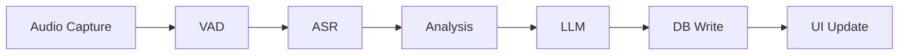

# Performance Profiling Design Plan

## Overview

This document outlines the design for a lightweight performance profiling system to identify bottlenecks in the MyASR Japanese learning overlay application.

## Current Pipeline Architecture

The application follows a sequential pipeline architecture:



### Pipeline Stages

| Stage | Module | Description |
|-------|--------|-------------|
| Audio Capture | `src/audio/capture.py` | WASAPI loopback or sounddevice capture |
| VAD | `src/vad/silero.py` | Silero VAD for speech detection |
| ASR | `src/asr/qwen_asr.py` | Qwen3-ASR-0.6B transcription |
| Analysis | `src/analysis/pipeline.py` | Tokenizer + Vocab lookup + Grammar match |
| LLM | `src/llm/ollama_client.py` | Ollama translation/explanation |
| DB Write | `src/db/repository.py` | SQLite insert operations |
| UI Update | `src/ui/overlay.py` | Qt signal emission and rendering |

## Profiling Design

### Module Structure

```
src/
├── profiling/
│   ├── __init__.py          # Public API exports
│   ├── config.py            # ProfilingConfig dataclass
│   ├── timer.py             # StageTimer context manager
│   └── profiler.py          # PipelineProfiler class
```

### Components

#### 1. ProfilingConfig

Configuration dataclass for profiling behavior:

```python
@dataclass
class ProfilingConfig:
    enabled: bool = True
    log_individual_stages: bool = True      # Log each stage timing
    log_summary: bool = True                 # Log end-to-end summary
    summary_interval: int = 10               # Log aggregate stats every N sentences
    slow_threshold_ms: float = 1000.0        # Warn if stage exceeds threshold
```

#### 2. StageTimer

Context manager for measuring individual stage duration:

```python
class StageTimer:
    def __init__(self, stage_name: str, profiler: PipelineProfiler | None = None)
    def __enter__(self) -> StageTimer
    def __exit__(self, *args) -> None
    @property
    def elapsed_ms(self) -> float
```

Usage:
```python
with StageTimer("asr", profiler) as timer:
    text = self._asr.transcribe(segment.samples)
# Automatically logs and records to profiler
```

#### 3. PipelineProfiler

Main profiler class for aggregating and reporting metrics:

```python
class PipelineProfiler:
    def __init__(self, config: ProfilingConfig)
    
    # Record a stage timing
    def record(self, stage: str, elapsed_ms: float) -> None
    
    # Start a new sentence processing cycle
    def start_sentence(self) -> None
    
    # End current sentence cycle and return summary
    def end_sentence(self) -> dict[str, float]
    
    # Get aggregate statistics
    def get_stats(self) -> ProfilingStats
    
    # Reset all statistics
    def reset(self) -> None
```

### Data Structures

```python
@dataclass
class StageMetrics:
    count: int = 0
    total_ms: float = 0.0
    min_ms: float = float("inf")
    max_ms: float = 0.0
    
    @property
    def avg_ms(self) -> float:
        return self.total_ms / self.count if self.count > 0 else 0.0

@dataclass
class ProfilingStats:
    stages: dict[str, StageMetrics]
    sentences_processed: int = 0
    total_pipeline_ms: float = 0.0
```

### Integration Points

The profiler integrates into [`PipelineWorker.run()`](src/pipeline.py:77):

```python
def run(self) -> None:
    # ... initialization ...
    
    while self._running:
        # ... config update ...
        
        # Audio capture timing
        with StageTimer("audio_capture", self._profiler):
            chunk = self._audio_queue.get(timeout=0.1)
        
        # VAD timing
        with StageTimer("vad", self._profiler):
            segments = self._vad.process_chunk(chunk)
        
        for segment in segments:
            self._profiler.start_sentence()
            
            # ASR timing
            with StageTimer("asr", self._profiler):
                text = self._asr.transcribe(segment.samples)
            
            # Analysis timing
            with StageTimer("analysis", self._profiler):
                analysis = self._preprocessing.process(text)
            
            # LLM timing
            with StageTimer("llm", self._profiler):
                translation, explanation = self._llm.translate(text)
            
            # DB timing
            with StageTimer("db", self._profiler):
                # ... DB insert ...
            
            # Get sentence summary
            summary = self._profiler.end_sentence()
            logger.info("Sentence processed: %s", summary)
```

### Log Output Format

#### Individual Stage Timing

```
INFO  [profiling] Stage 'asr' completed in 234.5 ms
WARN  [profiling] Stage 'llm' slow: 1523.2 ms (threshold: 1000.0 ms)
```

#### Sentence Summary

```
INFO  [profiling] Sentence #42: audio=0.1ms vad=12.3ms asr=234.5ms analysis=5.2ms llm=856.7ms db=2.1ms total=1110.9ms
```

#### Aggregate Statistics (every N sentences)

```
INFO  [profiling] === Performance Summary (100 sentences) ===
INFO  [profiling] audio_capture: avg=0.1ms min=0.0ms max=1.2ms total=12.3ms
INFO  [profiling] vad: avg=15.2ms min=8.1ms max=45.3ms total=1520.0ms
INFO  [profiling] asr: avg=245.3ms min=180.2ms max=512.8ms total=24530.0ms
INFO  [profiling] analysis: avg=4.8ms min=2.1ms max=15.6ms total=480.0ms
INFO  [profiling] llm: avg=923.5ms min=450.2ms max=2345.6ms total=92350.0ms
INFO  [profiling] db: avg=2.3ms min=0.8ms max=12.4ms total=230.0ms
INFO  [profiling] Total pipeline time: 119122.3ms
INFO  [profiling] =============================================
```

### Configuration Integration

Add profiling settings to [`AppConfig`](src/config.py):

```python
@dataclass
class AppConfig:
    # ... existing fields ...
    profiling: ProfilingConfig = field(default_factory=ProfilingConfig)
```

## Implementation Plan

### Phase 1: Core Profiling Module

1. Create `src/profiling/__init__.py` with public exports
2. Create `src/profiling/config.py` with `ProfilingConfig` dataclass
3. Create `src/profiling/timer.py` with `StageTimer` context manager
4. Create `src/profiling/profiler.py` with `PipelineProfiler` class

### Phase 2: Integration

1. Add `ProfilingConfig` to `AppConfig` in `src/config.py`
2. Initialize profiler in `PipelineWorker.__init__()`
3. Wrap each pipeline stage with `StageTimer` in `PipelineWorker.run()`
4. Add logging statements for metrics output

### Phase 3: Testing

1. Create `tests/test_profiling.py` with unit tests
2. Test `StageTimer` timing accuracy
3. Test `PipelineProfiler` aggregation logic
4. Test integration with `PipelineWorker`

## Design Decisions

### Why Context Manager Pattern?

- Clean separation of timing logic from business logic
- Automatic timing via `__enter__` / `__exit__`
- Exception-safe (still records timing on error)
- Easy to add/remove profiling points

### Why Not Use cProfile?

- cProfile adds overhead to every function call
- We only need stage-level timing, not function-level
- Simpler output format for identifying bottlenecks
- Lower runtime overhead

### Why Not Use Third-Party Profilers?

- Keep dependencies minimal
- Simple timing requirements don't justify external packages
- Easy to customize logging format

## Expected Bottlenecks

Based on the architecture analysis, expected bottlenecks in order of likelihood:

1. **ASR (Qwen3-ASR-0.6B)**: GPU inference, likely 200-500ms per segment
2. **LLM (Ollama)**: Network call + inference, likely 500-2000ms per sentence
3. **VAD (Silero)**: CPU inference, likely 10-50ms per chunk
4. **Analysis**: Tokenizer + lookups, likely 1-10ms per sentence
5. **DB**: SQLite inserts, likely 1-5ms per sentence
6. **Audio Capture**: Callback-based, negligible timing

## Success Criteria

- [ ] Each pipeline stage timing is logged
- [ ] Slow stage warnings are emitted when threshold exceeded
- [ ] Aggregate statistics are logged periodically
- [ ] Profiling can be disabled via configuration
- [ ] Unit tests pass with >90% coverage
- [ ] No significant performance impact when profiling disabled